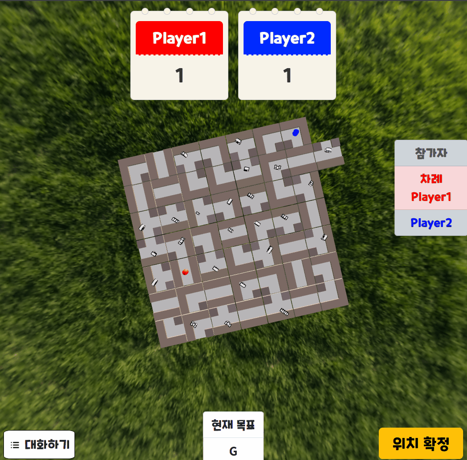
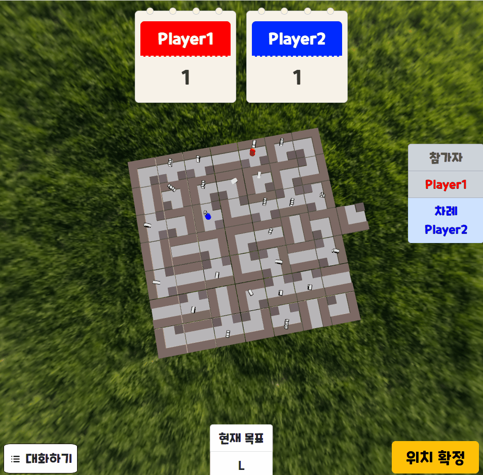

# 웹환경 3D 멀티플레이 라비린스 (Labyrinth)

평소 좋아하는 보드게임을 직접 구현해보고 싶다는 생각과 Three.js에서 아이디어를 얻어 시작

## 설치 및 시작

```bash
// server start
// labyrinth\backend_nodejs
npm run start

// client start
// labyrinth\frontend
npm install
npm start
```

> 위에서 서버와 클라이언트 모두 실행했다면
> "localhost:3000" 로 접속.
>
> Alabyrinth\frontend\src\App.js 에서  
> netAddress 값을 바꾸는 것으로 경로 바꾸기 가능

> After running both the server and client, you can access the application at http://localhost:3000.
>
> To change the route, modify the netAddress value in Alabyrinth/frontend/src/App.js.

## 프로젝트 흐름

### 로그인 페이지


<Br/><Br/><Br/><Br/>

### 게임준비 화면


<Br/><Br/><Br/><Br/>

### 채팅


<Br/><Br/><Br/><Br/>

### 타일 드래그 앤 푸쉬

<div style="display: flex; justify-content: space-between;">
  
  
</div>
<Br/><Br/><Br/><Br/>

### 게임말 이동

<div style="display: flex; justify-content: space-between;">
  
  
</div>

<Br/><Br/><Br/><Br/>

### 게임 종료


## 시스템 구조도


## 기술스텍

```jsx
**[frontend]**
-react "^18.3.1"
-socket.io-client "^4.7.5"
-three "^0.167.1"
-react-three/fiber "^8.16.8"

**[backend]**
-express "^4.19.2"
-socket.io "^4.7.5"
```

## 프로젝트 인원
최현호